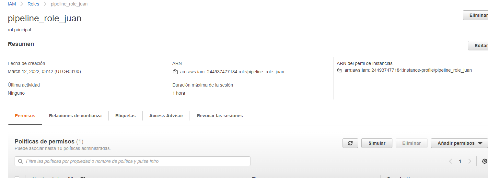
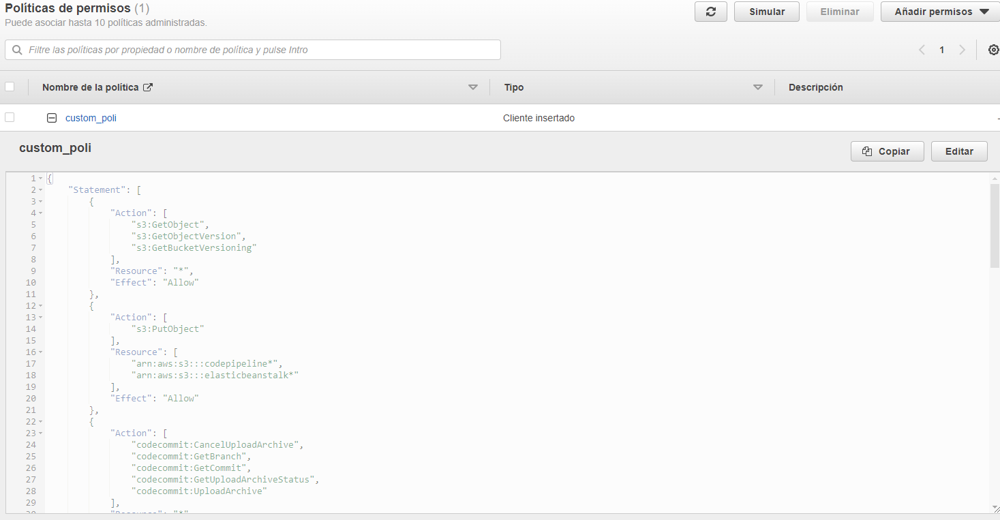
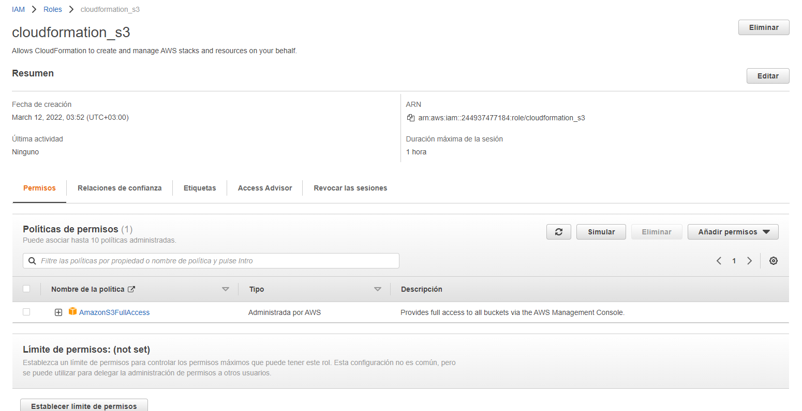
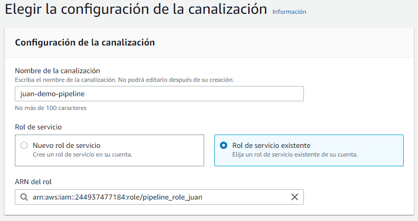
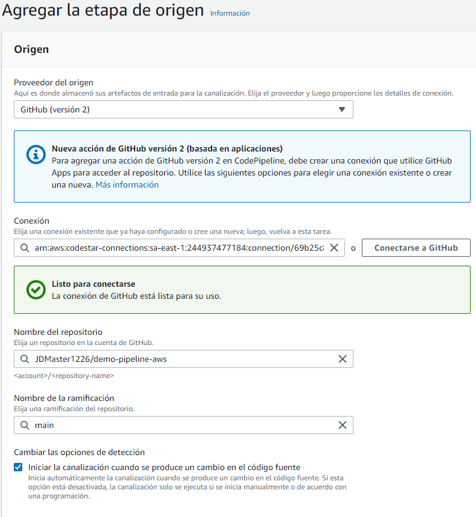
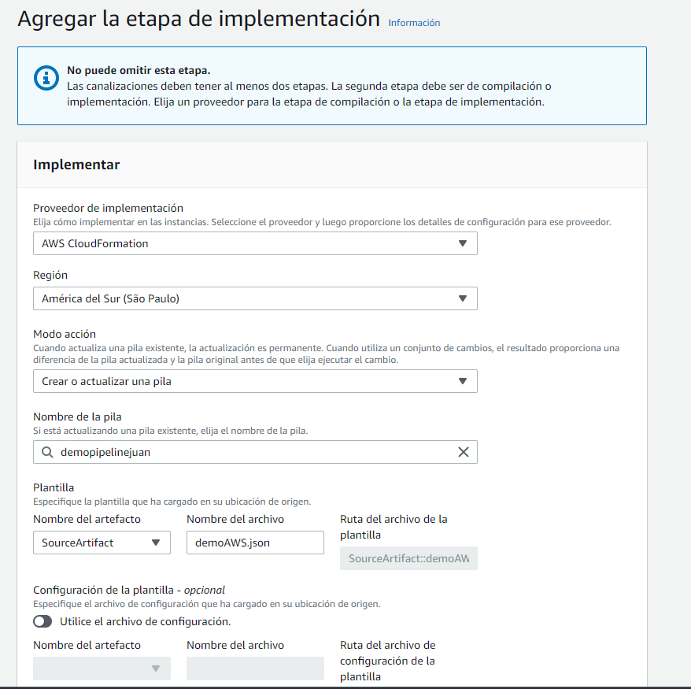
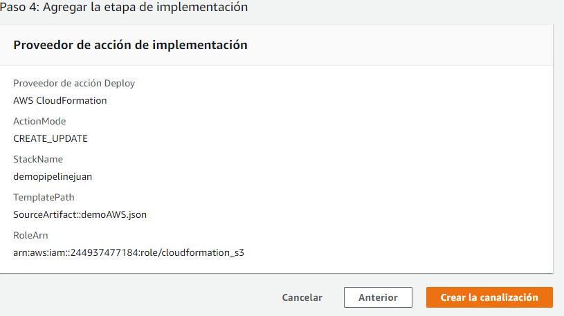
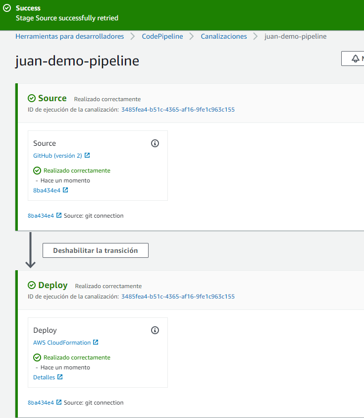
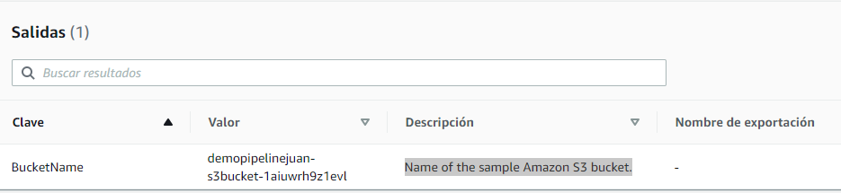
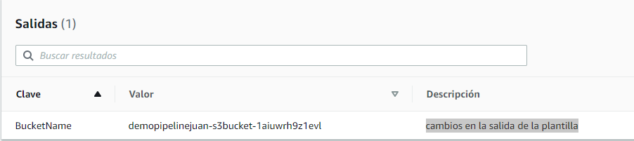

# Integración continua con AWS - CloudFormation 

A continuación se muestra un ejemplo basico de una infraestructura creada para AWS con una integracion continua por medio de la implementacion de CloudFormation.

## 1. Creación de Roles
Como primer paso se crearon dos Roles, los cuales se describen a continuación:

**pipeline_role_juan**: Este corresponde a los permisos que necesita el Pipeline correspondiente a la herramienta de AWS



El rol de pipeline necesita permisos adicionales, el cual con esta configuracion de json se añaden dichos permisos, como se ve en la siguiente imagen:



El siguiente rol a crear es el de **cloudformation** el cual nos permite hacer el deploy automatico.



 ## 2. Configuración
Crear el pipeline con la herramienta **codePipeline** y se selecciona el rol creado anteriormente



Se procede a realizar la conexión del repositorio de gitHub, como se muestra a continuación


 
Para la configuración de cloudformation se necesita la plantilla creada llamada **demoAWS.json** y el rol llamado **cloudformation_s3** creado anteriormente



A continuación podemos evidenciar el resumen de la configutacion creada y la creación del pipeline.



Para que funcione correctamente se debe agregar el siguiente permiso a cada rol

```json
{
    "Version": "2012-10-17",
    "Statement": [
        {
            "Effect": "Allow",
            "Action": "codestar-connections:UseConnection",
            "Resource": "arn:aws:codestar-connections:sa-east-1:244937477184:connection/69b25c8e-7afe-47de-b963-5d55817e8751"
        }
    ]
}
```

El pipeline se empezara a ejecutar y debe salir exitosa como se muestra a continuación



Cada vez que se actualiza la rama, se puede evidenciar que se realiza el deploy automatico. 






**Se utilizaron las tecnologias descritas anteriormente principalmente porque son las tecnologias en las cuales tengo mas conocimiento, aclarando que AWS CloudFormation y Jenkins son muy utilizadas y con ambas se lograria una buena implementacion de automatización.**
